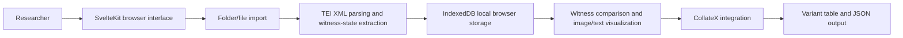

# Architecture

## Context

Collens is a browser-based research software application for digital humanities scholars working with multiple manuscript witnesses. It helps users inspect TEI XML transcriptions, compare textual states, keep manuscript images close to the relevant text, and send selected witnesses to CollateX-based collation workflows.

## Users

- Digital humanities researchers.
- Textual scholars and editors.
- Manuscript studies researchers working with TEI/XML witnesses.
- Project teams preparing examples, workshops, or exploratory collation sessions.

## System overview

## Main components

| Component | Purpose | Notes |
| --- | --- | --- |
| SvelteKit app | Browser interface and routing | Built with Vite and adapter-static for GitHub Pages-style deployment. |
| TEI parser utilities | Extract textual states and editorial interventions | Handles additions, deletions, substitutions, unclear/supplied text, page and line breaks. |
| File import utilities | Load local project folders and example datasets | Supports batch handling of XML and manuscript image assets. |
| IndexedDB storage | Persist project data locally in the browser | Enables offline/local project use. |
| Witness comparison views | Display multiple textual witnesses side by side | Supports toggling witnesses, synchronized scrolling, and statistics. |
| Image views | Keep manuscript images near transcriptions | Supports thumbnails, sorting, zoom/fullscreen, and page synchronization. |
| CollateX integration | Generate collation output from selected witnesses | Uses external collation service integration where configured/available. |

## Data flow

1. The user opens the browser application.
2. The user selects an example project or imports a local folder.
3. XML and image files are parsed and stored in local browser storage.
4. TEI markup is transformed into displayable witness states.
5. Witnesses and images are visualized side by side.
6. Selected text can be sent to CollateX integration for variant-table output.
7. Results can be inspected in the interface and exported as JSON where supported.

## Quality attributes

- Usability for scholarly interpretation.
- Preservation of TEI editorial semantics during visualization.
- Local/offline operation where practical.
- Transparent limitations around external collation services.
- Maintainable TypeScript/Svelte components and utilities.
- Test coverage for parsing and utility behaviour.

## Known risks

- External CollateX service availability can affect collation features.
- TEI practices vary across projects; parser assumptions should be documented and tested with new corpora.
- Browser storage is convenient but not a preservation system.
- GitHub Pages deployment requires repository Pages configuration in addition to the workflow.

## Handover notes

Start with `README.md`, `package.json`, `src/lib/utils`, `src/lib/components`, `src/routes/docs`, and the tests in `tests/`. Run `bun install`, `bun run check`, `bun test`, and `bun run build` before releases.
